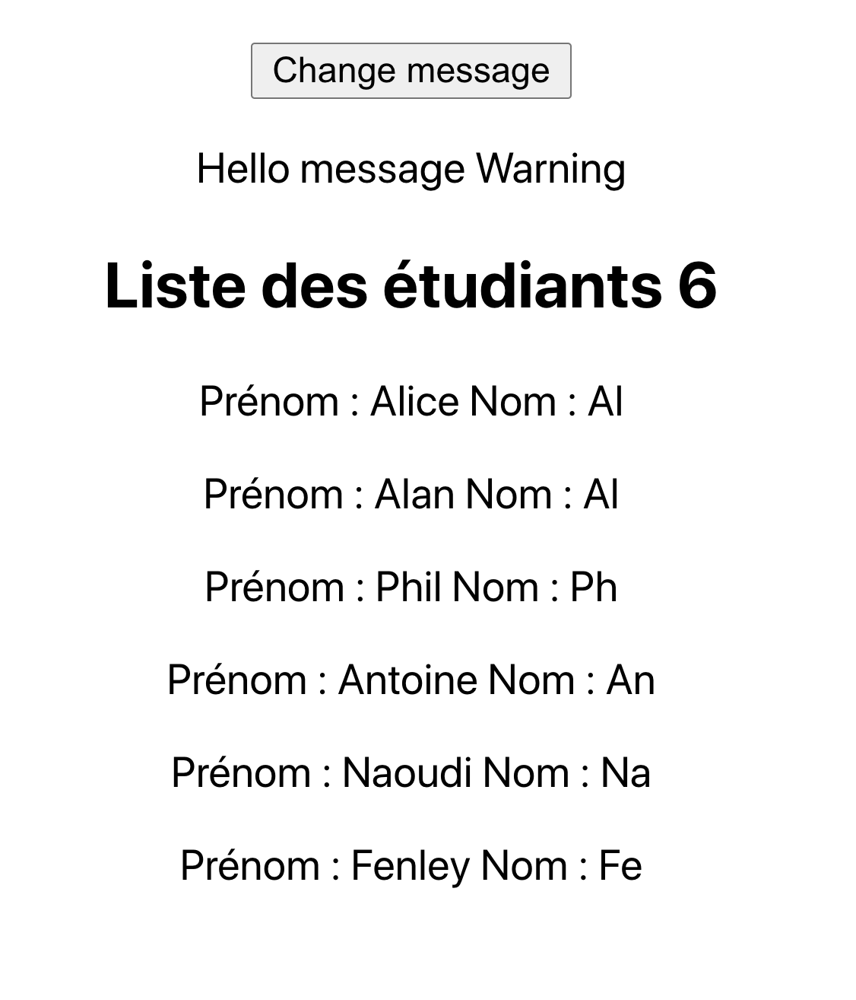

# React & tests

## Ecrire son premier test dans React

### Mise en garde sur les effets de bord d'un test avec React

Lorsque vous effectuez un test avec React il faut réaliser le rendu d'un arbre React au sein d'un élément du DOM. Ainsi lorsque vous terminez le test il faudra nettoyer et démonter l'arbre présent dans le document pour garder le principe de l'isolation d'un test. La technique courante pour faire cela est l'utilisation de beforeEach et afterEach pour synchroniser avant et après chaque test le montage et démontage des éléments testés :

```js
import { unmountComponentAtNode } from "react-dom";

let container = null;
beforeEach(() => {
  // met en place un élément DOM comme cible de rendu
  container = document.createElement("div");
  document.body.appendChild(container);
});

afterEach(() => {
  // nettoie en sortie de test
  unmountComponentAtNode(container);
  container.remove();
  container = null;
});

```

La méthode act() de React sera utilisée comme méthode utilitaire pour gérer les événements et le chargement des données utilisateurs. Le nom de cette méthode act() vient de l'acronyme ACT qui signifie Arrange-Act-Assert :

- Arrange all necessary preconditions and inputs.
- Act on the object or method under test.
- Assert that the expected results have occurred.

Pour lancer les tests en React avec create-react-app il suffit de taper à la racine du projet la commande suivante :

```bash
npm test
```

## Application présence d'un titre

Nous allons tester la présence d'un titre dans le DOM. Installez un projet à l'aide de create-react-app **school**.

Puis créez le composant Message dans un dossier components dans le dossier src :

```js
import React from "react";

const Message = ({ content, type }) =>  <p className={`message ${type}`}>{content}</p>;

export default Message;
```

Ecrivez le code suivant dans le composant App.js :

```js
import React, { useState } from 'react';
import './App.css';
import Message from './components/Message';

const App = () => {
  const [change, setChange] = useState(true);

  return (
    <div className="App">
      <p><button className="btn-change" onClick={() => setChange(!change)}>Change message</button></p>
      {change ?
        <Message type="warnig" content="Hello Message Warning" /> :
        <Message type="danger" content="Hello Message Danger" />
      }
    </div>
  );
}

export default App;
```

Nous allons maintenant essayer de tester les différents messages que le composant App reçoit. Créez le composant de test Message.test.js dans le dossier components.

```js
import React from "react";
import { render, unmountComponentAtNode } from "react-dom";
import { act } from "react-dom/test-utils";

import Message from './components/Message';

let container = null;
beforeEach(() => {
  // Créer une cible
  container = document.createElement("div");
  document.body.appendChild(container);
});

afterEach(() => {
  // Nettoyez le DOM en retirant l'arbre monté
  unmountComponentAtNode(container);
  container.remove();
  container = null;
});

it("Messages", () => {
  const data = [
    {
      type: "warning",
      content: "Hello message Warning"
    },
    {
      type: "danger",
      content: "Hello message Danger"
    },
  ];
  act(() => {
    render(<Message { ...data[0] } />, container);
  });
  expect(container.textContent).toBe("Hello message Warning");

  act(() => {
    render(<Message { ...data[1] } />, container);
  });
  expect(container.textContent).toBe("Hello message Danger");;
});
```

Pour tester le composant App.js nous resterons dans le fichier Message.test.js :

```js
it("Click and change message", () => {

  // Ajout du composant App pour les tests
  act(() => {
    render(<App />, container);
  });
  const button = document.querySelector(".btn-change");
  expect(button.innerHTML).toBe("Change message");
});

```

Puis à l'aide de la méthode **act** nous allons déclencher l'action "click" (gestion des comportements) :

```js
act(() => {
    button.dispatchEvent(new MouseEvent("click", { bubbles: true }));
});

```

Vous devez passer { bubbles: true } dans MouseEvent afin que l'événement puisse atteindre l'écouteur de React qui délègue automatiquement les événements au niveau racine du document.

Voici un exemple complet qui vous permettra de bien comprendre le montage des éléments et les tests sur les différents contenus dans le DOM.

```js
it("Click and change message", () => {

  act(() => {
    render(<App />, container);
  });

  const button = container.querySelector(".btn-change");
  expect(button.innerHTML).toBe("Change message");

  // Test au montage des éléments
  const messageDefault = container.querySelector('.warning');
  expect(messageDefault.textContent).toBe("Hello message Warning");

  act(() => {
    button.dispatchEvent(new MouseEvent("click", { bubbles: true }));
  });

  // Une fois que l'on a cliqué on peut tester le contenu qui a changé
  const messageDanger = container.querySelector('.danger');
  expect(messageDanger.textContent).toBe("Hello message Danger");

  act(() => {
    button.dispatchEvent(new MouseEvent("click", { bubbles: true }));
  });
  
  // On reclique donc le contenu a changé on peut le tester
  const messageWarning = container.querySelector('.warning');
  expect(messageWarning.textContent).toBe("Hello message Warning");
});
```

## 01 Exercice School Détails d'un étudiant

Créez le fichier students.json et placez le dans un dossier data dans le dossier public puis, chargez le dans le composant App.js à l'aide de la méthode fetch en utilisant useEffect. Utilisez une variable d'environement définissant l'URL de chargement (fichier .env à la racine du projet). Voyez ce qui suit :


```json
{
    "students": [
        {
            "id": 1,
            "name": "Alice",
            "lastname" : "Al",
            "grade": "master 5",
            "notes": [
                18,
                16,
                8,
                11
            ]
        },
        {
            "id": 2,
            "name": "Alan",
            "lastname" : "Al",
            "grade": "master 3",
            "notes": [
                9,
                15,
                18,
                11
            ]
        },
        {
            "id": 3,
            "name": "Phil",
            "lastname" : "Ph",
            "grade": "master 2",
            "notes": [
                10,
                12,
                16,
                11
            ]
        },
        {
            "id": 4,
            "name": "Antoine",
            "lastname" : "An",
            "grade": "master 5",
            "notes": [
                13,
                19,
                16,
                18
            ]
        },
        {
            "id": 5,
            "name": "Naoudi",
            "lastname" : "Na",
            "grade": "master 2",
            "notes": [
                15,
                16,
                18,
                20
            ]
        },
        {
            "id": 6,
            "name": "Fenley",
            "lastname" : "Fe",
            "grade": "master 2",
            "notes": [
                10,
                12,
                13,
                11
            ]
        }
    ]
}
```


Créez un fichier .env (racine du projet) dans lequel vous écrirez les constantes d'environement suivantes, React est configurée avec **dotenv** qui permet de gérer les variables d'environement :

```txt
DOMAIN=http://localhost:3000
REACT_APP_STUDENTS=$DOMAIN/data/students.json
```

Affichez le nom et le prénom des étudiants dans un composant Student dans App.js

Chaque nom d'étudiant dans le composant App.js sera cliquable et on affichera pour chacun d'entre eux les détails suivants : grade et moyenne dans la même page. Implémentez une action permettant d'afficher ces détails (système toggle).

Affichez également le nombre d'étudiants dans un titre de niveau 2. Voyez le wireframe qui suit :




## Modifier le test précédent

Modifiez le code du test précédent (Message.test.js) afin d'intégrer la partie asynchrone du fetch pour récupérer les données (student.json).

```js

it("Click and change message", async () => {

  const fakeStudents = {
    students: [{
      id: 1,
      name: "Alan",
      lastname: "Al",
      notes: [],
      grade: "master 5"
    }]
  };

  // Mock du fetch
  jest.spyOn(global, "fetch").mockImplementation(() =>
    Promise.resolve({
      json: () => Promise.resolve(fakeStudents)
    })
  );

  await act(async () => {
    render(<App />, container);
  });

});

```

## Tester l'application

1. Vérifiez le nombre d'étudiant(s). Utilisez une méthode de simulation pour éviter l'utilisation de fetch dans vos tests.

```js
it("Nombre d'étudiant", async () => {

  const fakeStudents = { students : [ {
      id: 1,
      name: "Alan",
      lastname: "Al",
      notes: [11, 12],
      grade: "master 5"
    } ]
  };

// Mock de l'appel fetch
  jest.spyOn(global, "fetch").mockImplementation(() =>
      Promise.resolve({
        json : () => Promise.resolve(fakeStudents)
      })
  );

  // Attendre que la promesse soit résolue
  await act( async () => {
      render(<App />, container);
  });

});
```

2. Ecrire un test qui vérifie que lorsqu'on clique sur un étudiant alors on obtient les détails suivants : grade et moyenne. Vérifiez que la moyenne est correctement calculée (test unitaire).
